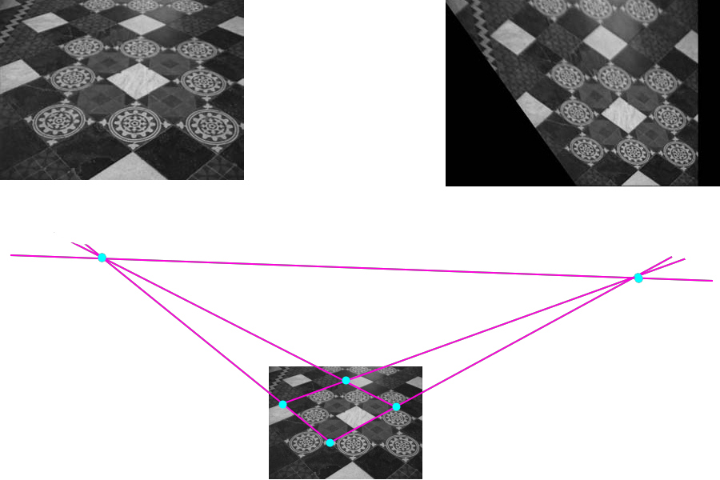

# Khôi phục tính chất affine và metric từ một bức ảnh.

Bức ảnh có tình chất affine sẽ phải đảm bảo các góc bằng nhau ngoài đời thật thì bằng nhau trong ảnh, còn tính chất metric đảm bảo các đường thẳng bằng nhau ngoài đời thì phải bằng nhau trong ảnh. Phần này sẽ sơ lược qua cách khôi phục 2 tính chất trên từ một bức ảnh khi có thể xác định được một số yếu tố trong ảnh, cụ thể đó là đường thẳng tại vô cùng (line at infinity) $l_\infty$ và điểm tròn (circular point) nằm trên $l_\infty$.

## Đường thẳng tại vô cùng
Như ta đã biết, $l_\infty = (0, 0, 1)^T$. Dưới projective transformation, $l_infty$ có thể được biến thành một đường không phải ở vô cùng, nhưng dưới affine transformation, $l_\infty$ không đổi (kiểm chứng bằng cách lấy $H^T . l_\infty$ sẽ ra 0, với $H$ là phép biến đổi affine).

Tuy rằng $l_\infty$ không đổi sau phép biến đổi affine nhưng các điểm ở vô cùng (nằm trên nó) lại không tương ứng 1-1 sau phép biến đổi này. 

## Khôi phục tính chất affine
Nếu ta đã xác định được $l_\infty$ có ảnh là đường thẳng $l = (l_1, l_2, l_3)^T$ trên ảnh, vậy phép biến đổi ảnh về một ảnh khác đảm bảo tính affine sẽ là:
$$ H = H_A \begin{bmatrix}
1 & 0 & 0 \\
0 & 1 & 0 \\
l_1 & l_2 & l_3
\end{bmatrix}$$
Với $H_A$ là phép affine **bất kì**.

Ta có thể kiểm chứng: $H^-T(l_1, l_2, l_3)^T = (0, 0, 1) = l_\infty$

*Ví dụ về cách đưa về tính affine. Vẫn là sàn nhà đó, nhưng màu đen trắng :smile:.*

## Điểm tròn
Circular point là 2 điểm có tọa độ như sau, $I = (1, i, 0)$ và $J = (1, -i, 0)$ với $i$ là đơn vị ảo của só phức. Không như $l_\infty$, $I, J$ không cố định sau phép biến đổi affine, nhưng lại cố định sau phép similarity.

Lý do gọi nó là "điểm tròn" vì 2 điểm này là giao của bất cứ đường tròn nào với $l_\infty$. Và cũng vì lý do này, mỗi đường tròn cũng là 1 conic xác định bởi 5 điểm (gồm 2 điểm tròn).
> Thật vậy, một conic là đường tròn với $a = c$ và $b = 0$, như vậy phương trình đồng nhất của đương tròn sẽ là
$$x^2 + y^2 + dxz + eyz + fz^2 = 0$$
và 2 điểm trên đều thỏa mãn phương trình này.

### Dual conic tạo bởi 2 điểm tròn
Conic này có dạng:

$$C^*_\infty 
= IJ^T + JI^T
= \begin{pmatrix} 1 \\ i \\ 0\end{pmatrix}
  \begin{pmatrix}1 & -i & 0\end{pmatrix}
+
  \begin{pmatrix}1 \\ -i \\ 0\end{pmatrix}
  \begin{pmatrix}1 & i & 0 \end{pmatrix}
= \begin{bmatrix}
    1 & 0 & 0 \\
    0 & 1 & 0 \\
    0 & 0 & 0
\end{bmatrix}$$

Conic có rank 2 và cũng cố định sau phép biến đổi similarity. Ngoài ra $l_\infty$ là null vector của $C^*_\infty$ ($C^*_\infty l_\infty = 0$).

## Đo góc trong mặt phẳng projective
Với hai đường thẳng $l = (l_1, l_2, l_3)$ và $m = (m_1, m_2, m_3)$, góc của chúng được đo bằng tích vô hường giữa 2 vector pháp tuyến:

$$cos\theta = \frac{
    l_1m_1 + l_2m_2
}{
   \sqrt{(l_1^2 + l_2^2)(m_1^2 + m_2^2)} 
}$$

Công thức trên khó có thể sử dụng để tính toán trên ảnh khi chưa biết phương trình thật của chúng. Để có thể làm được điều đó, ta có thể biến đổi công thức trên như sau:

$$cos\theta = \frac{
    l^TC^*_\infty m
}{
    \sqrt{(l^TC^*_\infty l)(m^TC^*_\infty m)}
}$$

Công thức trên đảm bảo góc luôn được giữ nguyên trên mặt phẳng projective. Như vậy nếu $C^*_\infty$ được xác định trên mặt phẳng projective thì góc sẽ được tính theo công thức trên.

Hệ quả, với $l^TC^*_\infty m= 0$ thì $l$ và $m$ vuông góc với nhau.

## Khôi phục tính metric từ hình ảnh.
> TODO

---