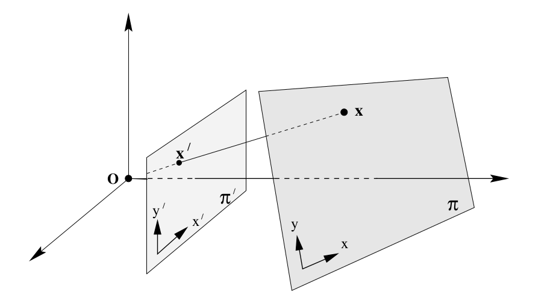
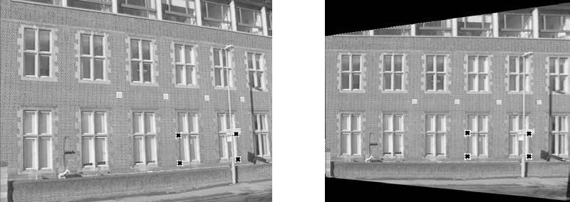
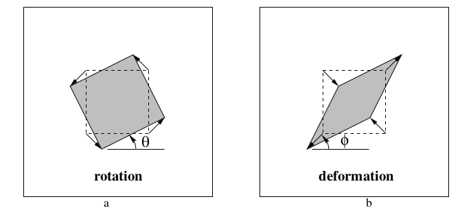

# Phép biến đổi xạ ảnh - Projective transformation
Một phép xạ ảnh là một song ánh $h$ từ $\mathbb{P}^2$ đến chính nó thỏa mãn với 3 điểm bất kì thẳng hàng $p_1, p_2$ và $p_3$ thì 3 điểm $h(p_1), h(p_2))$ và $h(p_3)$ cũng phải thẳng hàng. Hình ở phần mở đầu là ví dụ cho phép biến đổi xạ ảnh.
## Định lý về phép xạ ảnh.
Phép ánh xạ $h: \mathbb{P}^2 \to \mathbb{P}^2$ là phép xạ ảnh khi và chỉ khi tồn tại 1 matrix khả nghịch $3 \times 3$ $H$ thỏa mãn với điểm bất kì thuộc mặt phẳng đc biểu diễn bởi vector $x$ thì $h(x) = Hx$.
Cụ thể, với điểm $x = (a, b, c)^T$ và matrix $H = \begin{bmatrix}
    h_{11} & h_{12} & h_{13} \\
    h_{21} & h_{22} & h_{23} \\
    h_{31} & h_{32} & h_{33}
\end{bmatrix}$ thì:

$$ h(x) =
\begin{bmatrix}
    h_{11} & h_{12} & h_{13} \\
    h_{21} & h_{22} & h_{23} \\
    h_{31} & h_{32} & h_{33}
\end{bmatrix}
\begin{pmatrix} a \\ b \\ c \end{pmatrix}
= \begin{pmatrix}
    ah_{11} + bh_{12} + ch_{13} \\
    ah_{21} + bh_{22} + ch_{23} \\
    ah_{31} + bh_{32} + ch_{33}
\end{pmatrix}
= \begin{pmatrix} a' \\ b' \\ c' \end{pmatrix}$$

## Phép biến đổi giữa 2 mặt phẳng

*Phép chiếu xuyên tâm từ 1 điểm trên mặt phẳng này đến mặt phẳng khác*

Tưởng tượng ở hai vị trí *gần nhau* trong không gian, với 2 góc nhìn khác nhau và cùng nhìn vào một mặt phẳng. Hình ảnh của mặt phẳng đó ta thu được bởi mắt thường, máy ảnh tuy sẽ khác nhau, nhưng các chi tiết vẫn như vậy. Nhờ phép biến đổi xạ ảnh, ta có thể biến đổi hình ảnh từ vị trí này sang vị trí kia và ngược lại, hay đến một vị trí khác. Điều ta muốn ở đây là đưa hình ảnh về vị trí đừng đối diện với mặt phẳng, nơi mà chi tiết không bị *méo mó*.

*Nhờ phép phép biến đổi xạ ảnh, ta có thể xóa đi sự bóp méo hình ảnh từ một góc nhìn máy ảnh*

## Xạ ảnh của đường thẳng và đường conic
Với phép xạ ảnh điểm $x' = Hx$ thì điểm $x'$ sẽ nằm trên đường thẳng $l' = H^{-T}l$.
> Thật vậy, vì $l^Tx = 0$ nên
$$l^TH^{-1}Hx = 0 \iff (H^{-T}l)^THX = 0$$ hay điểm $Hx$ sẽ nằm trên đường thẳng $H^{-T}l$.

Như vậy với sự biến đổi điếm $x' = Hx$ thì đương thẳng $l$ lại được biến đổi thành $l' = H^{-T}l$. Với phép chứng minh tương tự như trê, thì đường point conic $C$ sẽ được biến đổi thành $C' = H^{-T}CH^{-1}$ và line conic $C^*$ được biến đổi thành $C^*\text{'} = HC^*H^T$

## Phân cấp các loại biến đổi
Phần này tập chung vào phép biến đổi affine và projective. Ở cấp độ thấp nhất ta có phép biến đổi Isometries là phép biến đổi đảm bảo khoảng cách Euclidean trên mặt phẳng và hệ quả là góc và diện tích được giữ nguyên. Những phép như tịnh tiến, xoay, lấy đối xứng, ... là phép Isometries. Xem thêm tại [wikepedia](https://en.wikipedia.org/wiki/Isometry).

### Similarity transformations
Tương tự phép Isometries, và kết hợp thêm việc scale hình. Nó không đảm bảo độ dài, nhưng góc, tỉ lệ độ dài và tỉ lệ diện tích được dữ nguyên.

$$
\begin{pmatrix} x' \\ y' \\ z' \end{pmatrix}
= \begin{bmatrix}
    s.cos\theta & -s.sin\theta & t_x \\
    s.sin\theta & s.cos\theta & t_y \\
    0 & 0 & 1
\end{bmatrix}
\begin{pmatrix} x \\ y \\ z \end{pmatrix}
$$

Hay biểu diễn ma trận ở dạng block:
$$ x' = H_Sx = \begin{bmatrix}
sR& t \\ 0^T & 1
\end{bmatrix}x$$

Với $t = (t_x, t_y)^T$ và $0^T = (0, 0)$. Phép similarity đảm bảo "hình dáng" của hình ban đầu và có dof 4. Ma trận này có thể tính toán trực tiếp từ hai cặp điểm tương ứng trên mặt phẳng.

### Affine transformations

Biểu diễn của phép Affine transformation.
$$
\begin{pmatrix} x' \\ y' \\ z' \end{pmatrix}
= \begin{bmatrix}
    a_{11} & a_{12} & t_x \\
    a_{21} & a_{22} & t_y \\
    0 & 0 & 1
\end{bmatrix}
\begin{pmatrix} x \\ y \\ z \end{pmatrix}
$$
Ma trận này có dof 6 và có thể tính toán trực tiếp từ 3 cặp điểm tương ứng trên mặt phẳng.

Hay biểu diễn ma trận ở dạng block:
$$ x' = H_Sx = \begin{bmatrix}
A & t \\ 0^T & 1
\end{bmatrix}x$$

với $A = \begin{bmatrix}
    a_{11} & a_{12} \\
    a_{21} & a_{22}
\end{bmatrix}$

*Ví dụ về phép biến đổi affine. Hình thứ 2: đầu tiên ta xoay hình vuông theo góc $\phi$, dãn hình theo trục tung và co hình theo trục hoành rồi xoay hình lại góc $-\phi$*

Để dễ hiểu hơn ta có thể viết ma trận $A$ dưới dạng:
$$A = R(\theta)R(-\phi)DR(\phi)$$
Trong đó $R(\alpha)$ là ma trận $2\times2$ sẽ xoay vector $(x, y)$ một góc $\alpha$ và $D$ là ma trận $2\times2$ có dạng $\begin{bmatrix}
    \lambda_1 & 0 \\
    0 & \lambda_2
\end{bmatrix}$ thể hiện phép scale theo hệ số $\lambda_1$ và $\lambda_2$ tương ứng với trục hoành và tung. $A$ sẽ thực hiện những điều sau với vector $(x, y)$: quay một góc $\phi$, scale theo ma trận $D$, xoay hình ngược lại góc $\phi$ và cuối cùng lại xoay một góc $\theta$.

Sau phép biến đổi affine, các yếu tố sau vẫn được đảm bảo:
- Các đường thẳng song song vẫn song song.
- Tỉ lệ độ dài giữa các đoạn thẳng song song được bảo tồn.
- Tỉ lệ diện tích được bảo tồn.

### Projective transformations
Cũng giống như Affine transformations, nhưng vì ta đang sử dụng quy ước điểm và đường thẳng đồng nhất, như vậy ta có thể thay hàng cuối của ma trận biến đổi thành 1 ma trận khác.
Biểu diễn ở block form:
$$ x' = H_Sx = \begin{bmatrix}
A & t \\ \mathrm{v}^T & v
\end{bmatrix}x$$
Ma trận có dof 8 (do $(hH)x = H(kx)$, mà $kx$ biểu diễn cùng 1 điểm với $x$) và có thể tính toán trực tiếp từ 4 cặp điểm tương ứng.

Trong đó $\mathrm{v}^T = (v_1, v_2)$
Sau phép biến đổi này, các yếu tố như ở phép biến đổi affine sẽ không được đảm bảo nữa, thay vào đó chỉ duy nhất có tỉ số kép (crossratio) của 4 điểm thẳng hàng bằng nhau.

### So sánh với Affine transformations với Projective transformations.
Nhận xét với một điểm $(x_1, x_2, 0)^T$ ở vô cùng, thì với Affine transformations:
$$
\begin{bmatrix}A & t \\ 0^T & 1\end{bmatrix}
\begin{pmatrix}x_1 \\ x_2 \\ 0\end{pmatrix}
= \begin{pmatrix}
    A\begin{pmatrix}x_1 \\ x_2\end{pmatrix} \\
    0
\end{pmatrix}
$$
sẽ cho ra một điểm tại vô cùng, còn với projective transformation:
$$
\begin{bmatrix}A & t \\ \mathbf{v}^T & v\end{bmatrix}
\begin{pmatrix}x_1 \\ x_2 \\ 0\end{pmatrix}
= \begin{pmatrix}
    A\begin{pmatrix}x_1 \\ x_2\end{pmatrix} \\
    v_1x_1 + v_2x_2
\end{pmatrix}
$$
lại cho ra một điểm bình tường. Điều này cho phép projective transformation **dựng lên những điểm ở vô cùng**.

### Phân tích Projective transformations
Ta có thể phân tích một projective transformation thành các transformations khác nhau, mỗi transformation có cấp bậc cao hơn transformation trước nó.

$$H = H_S H_A H_P
= \begin{bmatrix}
    sR & t \\ 0^T & 1
\end{bmatrix}
\begin{bmatrix}
    K & 0 \\ 0^T & 1
\end{bmatrix}
\begin{bmatrix}
    I & 0 \\
    \mathbf{v}^T & v
\end{bmatrix}
=\begin{bmatrix}A & t \\ \mathbf{v}^T & v\end{bmatrix}
$$

Trong đó $A = sKR + t\mathbf{v}^T$ và $detK = 1$.
$H_S, H_A, H_P$ lần lượt là các phép biến đổi similarity, affine và projective (chỉ biến đổi tham số thứ 3 $z$).

---