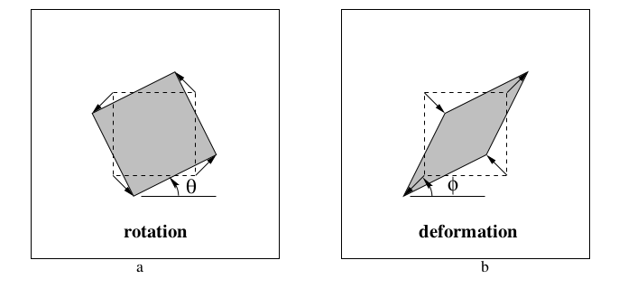

# Hình học xạ ảnh và phép biến đổi 2D
[TOC]
-----------------------------------

## Mở đầu
Trong chương trình trung học, ta đã biêt một số phép biến đổi hình học như tịnh tiến, xoay, vị tự, ... Một số phép biến đổi khác như phóng to (có thể phóng to theo chiều ngang, dọc hay cả 2 với tỉ lệ khác nhau), hay phép [shearing](https://en.wikipedia.org/wiki/Shear_mapping) làm méo hình, hoặc phép biến đổi hình học kết hợp tất cả các phép biến đổi khác lại. Các phép biến đổi đó đều chiếu một điểm hữu hạn thành một điểm hữu hạn khác. Tuy nhiên, nếu xét 2 hình sau đây:

*Hình ảnh sàn nhà gạch lát hoa được lấy từ sách và đã được edit lại.*

Bằng mắt thường ta đã có thể thấy rằng đây là 2 hình hoàn toàn giống nhau, tuy nhiên hai đường thẳng ở hình 1 song song với nhau thì đường thẳng tương ứng ở hình 2 lại cắt nhau. Vậy giữa 2 hình có phép biến đổi hình học nào không. Chắc chắn là có! Chương này giới thiệu qua hình học học xạ ảnh 2D, gồm các phép toán, phép biến đổi và một số phương pháp giúp ta có thể tìm được mối liên hệ giữa hai hình như trên.

## The 2D projective plan - Mặt phẳng xạ ảnh 2D
### [Phép chuyển vị của vector/matrix](https://vi.wikipedia.org/wiki/Ma_tr%E1%BA%ADn_chuy%E1%BB%83n_v%E1%BB%8B)

- Với một vector ngang (hoặc dọc) $x$ thì vector dọc (hoặc ngang) tương ứng với nó là $x^T$. Cụ thể, một vector ngang $x = (a_1, a_2, ... a_n)$ sẽ có vector dọc tương ứng là $x^T = \begin{pmatrix}
    a_1 \\
    a_2 \\
    \vdots \\
    a_n
\end{pmatrix}$ và ngược lại.
- **Mục đích** của phép chuyển vị là để cho việc nhân vector với matrix được dễ dàng.

- Khi viết $x = (a_1, a_2, ... a_n)$ ta hiểu đây là vector **ngang**.

### Phép nhân vector/matrix:
- Phép nhân matrix: [Tiếng anh](https://en.wikipedia.org/wiki/Matrix_multiplication), [Tiêng việt](https://vi.wikipedia.org/wiki/Ph%C3%A9p_nh%C3%A2n_m%E1%BB%99t_s%E1%BB%91_cho_ma_tr%E1%BA%ADn).
- Phép nhân vô hướng 2 vector: 2 vector cùng chiều $a, b$, thay vì ta viết $a.b$, ta sử dụng kí hiệu **chuyển vị** và chuyển nó thành phép **nhân ma trận** $ab^T$ hoặc $a^Tb$
- Tích có hướng của vector 3 chiều: [tiếng anh](https://en.wikipedia.org/wiki/Cross_product).
    + 2 vector $u = (a, b, c)$ và $v = (x, y, z)$ có tích có hướng $u \times v = ()$

### Quy ước cho đường thẳng *đồng nhất*:
- Vì mỗi đường thẳng trên mặt phẳng đều có phương trình dạng $ax + by + c = 0$ nên mỗi đường thẳng được chọn bởi bộ 3 số $(a, b, c)$ và ta sẽ đại diện mỗi đường thẳng bằng 1 vector **dọc** $(a, b, c)^T$.
- Vector $(0, 0, 0)^T$ sẽ **không** đại diện cho đường thẳng nào cả.
- Tập hợp các đường thẳng có dạng $(ka, kb, kc)^T$ với $k$ bất kì đều đại diện cho cùng 1 đường thẳng

### Quy ước cho điểm *đồng nhất*:
- Thay vị sử dụng cặp điểm, ta sử dụng vector **dọc** $(x, y, 1)^T$ để biểu diễn điểm $(x, y)$ trên mặt phẳng.
- **Mục đích** cho việc biểu diễn như vậy để có thể dễ dàng kiểm tra điểm $p = (x, y, 1)^T$ có thuộc đường thẳng bằng $l = (a, b, c)^T$ không bằng biểu thức $(x, y, 1).(a, b, c)^T = (ax + by + c) = 0$, hay nói cách khác, $p^Tl = 0$.
- Mở rộng ra, vector dọc $(x, y, z)^T$ có thể biểu diễn điểm $\displaystyle \left( \frac{x}{z}, \frac{y}{z} \right)$ trên mặt phẳng toạ độ.

### Degrees of freedom
> TODO

### Tìm giao của 2 đường thẳng
- Hai đường thẳng $l_1$ và $l_2$ sẽ có giao điểm $x = l_1 \times l_2$.
> Thật vậy, $l_1(l_1 \times l_2) = 0$ và $l_2(l_1 \times l_2) = 0$, do vector $l_1 \times l_2$ trong không gian cùng song song với cả $l_1$ và $l_2$. Như vậy $l_1$ và $l_2$ đều đi qua điểm $l_1 \times l_2$

### Tìm đường thẳng qua 2 điểm
- Hai điểm $p_1$ và $p_2$ có sẽ có đường thẳng $l = p_1 \times p2$ cùng đi qua chúng.
> Cũng như trên, do $p_1.(p_1 \times p_2) = 0$ và $p_2.(p_1 \times p_2) = 0$. Như vậy $p_1$ và $p_2$ đều thuộc đường thằng $p_1 \times p_2$

### Điểm và đuường thẳng ở vô cùng.
- Các điểm có dạng $(x_1, x_2, 0)^T$ là những điểm ở vô cùng, vì ta không thể tìm thấy điểm $(x_1/0, x_2/0)$ trên mặt phẳng tọa độ.
- Tập hợp các điểm ở vô cùng tạo thành đường thẳng ở vô cùng $(0, 0, 1)^T$ (thật vậy $(a, -b, 0)^T(0, 0, 1) = 0$).
- Mọi đường thẳng $l = (a, b, c)$ đều giao với đường thẳng $(0, 0, 1)^T$ tại điểm $(b, -a, 0)^T$

### A model for the projective plane
> Todo

### Tính đối lập (duality)
- Ta có thể đảo vai trò của điểm và đường thẳng cho nhau:
    + Chúng đều là vector 3 chiều dọc.
    + Biểu thức kiểm tra điểm $x$ nằm trên đường thẳng $l$ là $x^Tl = 0$ có thể đổi thành $l^Tx = 0$.
    + Ngoài ra việc tìm giao điểm và đường thẳng qua 2 điểm chúng đều có thể đảo chỗ cho nhau.
- Đây gọi là nguyên tắc đôi lập (duality principle)

### Đường conic và phương trình đường conic
> Todo

--------------------------------------

## Projective transformation - Phép biến đổi xạ ảnh.
### Định nghĩa
- Một phép xạ ảnh là một song ánh $h$ từ $\mathbb{P}^2$ đến chính nó thỏa mãn với 3 điểm bất kì thẳng hàng $p_1, p_2$ và $p_3$ thì 3 điểm $h(p_1), h(p_2))$ và $h(p_3)$ cũng phải thẳng hàng.
### Định lý về phép xạ ảnh.
- Phép ánh xạ $h: \mathbb{P}^2 \to \mathbb{P}^2$ là phép xạ ảnh khi và chỉ khi tồn tại 1 matrix khả nghịch $3 \times 3$ $H$ thỏa mãn với điểm bất kì thuộc mặt phẳng đc biểu diễn bởi vector $x$ thì $h(x) = Hx$.
- Cụ thể, với điểm $x = (a, b, c)^T$ và matrix $H = \begin{bmatrix}
    h_{11} & h_{12} & h_{13} \\
    h_{21} & h_{22} & h_{23} \\
    h_{31} & h_{32} & h_{33}
\end{bmatrix}$ thì:

$$ h(x) =
\begin{bmatrix}
    h_{11} & h_{12} & h_{13} \\
    h_{21} & h_{22} & h_{23} \\
    h_{31} & h_{32} & h_{33}
\end{bmatrix}
\begin{pmatrix} a \\ b \\ c \end{pmatrix}
= \begin{pmatrix}
    ah_{11} + bh_{12} + ch_{13} \\
    ah_{21} + bh_{22} + ch_{23} \\
    ah_{31} + bh_{32} + ch_{33}
\end{pmatrix}
= \begin{pmatrix} a' \\ b' \\ c' \end{pmatrix}$$

### Ánh xạ giữa 2 mặt phẳng

*Hình 1: Phép xạ ảnh xuyên tâm từ 1 điểm trên mặt phẳng này đến mặt phẳng khác*

Hình 1 là một ví dụ cho cách định lý trên được áp dụng như thế nào. Với mỗi một điểm bất kì $x$ thuộc mặt phẳng $\pi$ đều có một điểm $x'$ trên mặt phẳng $\pi'$ tương ứng với điểm $x$ là giao của $\pi'$ với $Ox$ và ngược lại. Hiển nhiên ánh xạ này là một song ánh.

### Xạ ảnh của đường thẳng và đường conic
- Với phép xạ ảnh điểm $x' = Hx$ thì điểm $x'$ sẽ nằm trên đường thẳng $l' = H^{-T}l$.
    + Thật vậy, vì $l^Tx = 0$ nên
    $$l^TH^{-1}Hx = 0 \iff (H^{-T}l)^THX = 0$$, hay điểm $Hx$ sẽ nằm trên đường thẳng $H^{-T}l$.
- Như vậy với sự biến đổi điếm $x' = Hx$ thì đương thẳng $l'$ lại được biến đổi thành $H^{-T}l$.
> Todo: xạ ảnh của đường conic

## A hierarchy of transformations
Tạm dịch là "cấp của các phép biến đổi"

### Lớp I: Isometries
"Iso" là giống nhau (same), "metric" là độ dài (mesure). Đây là phép biến đổi đảm bảo được khoảng cách Euclidean trên mặt phẳng. Phép biến đổi có thể là phép tịnh tiến, xoay, lấy đối xứng hoặc là phép biến đổi kết hợp giữa các phép đó.
#### Biểu diễn của phép biến đổi Isometries
$$
\begin{pmatrix} x' \\ y' \\ z' \end{pmatrix}
= \begin{bmatrix}
    \epsilon cos\theta & -sin\theta & t_x \\
    \epsilon sin\theta & cos\theta & t_y \\
    0 & 0 & 1
\end{bmatrix}
\begin{pmatrix} x \\ y \\ z \end{pmatrix}
$$
Trong đó:
    - $(t_x, t_y)$ là vector tịnh tiến.
    - $\theta$ là góc quay.
    - $\epsilon \in {-1, 1}$. nếu $\epsilon = 1$ thì đây là phép biến đổi cùng chiều, ngược lại đây là phép biến đổi ngược chiều (tức là đối xứng gương).
Hay ta có thể  viết dưới block form:
$$ x' = H_Ex = \begin{bmatrix}
R & t \\ 0^T & 1
\end{bmatrix}x$$
Với $R$ là matrix $2 \times 2$ trực giao (tức $R^TR = RR^T = I$ là ma trận cơ sở), $t$ là vector tịnh tiên. Nếu $R = I$, đây là phép thuần tịnh tiến, còn $t$ là vector 0 thì đây là phép thuần xoay.
#### Những thành phần bất biến (invariants)
Bao gồm độ dài, góc, và diện tích sẽ bất biến sau khi biến đổi.

### Lớp II: Similarity transformations
Đôi khi gọi là similarity, là phép Isometry kết hợp với phép scale (co dãn).
#### Biểu diễn của phép biến đổi Similarity.
Gần giống với Isometries.
$$
\begin{pmatrix} x' \\ y' \\ z' \end{pmatrix}
= \begin{bmatrix}
    \pm s.cos\theta & -s.sin\theta & t_x \\
    \pm s.sin\theta & s.cos\theta & t_y \\
    0 & 0 & 1
\end{bmatrix}
\begin{pmatrix} x \\ y \\ z \end{pmatrix}
$$
Hay block form:
$$ x' = H_Sx = \begin{bmatrix}
sR & t \\ 0^T & 1
\end{bmatrix}x$$
Trong đó $s$ là hệ số scale.

#### Thành phần bất biến.
Góc vẫn được dữ nguyên nhưng khoảng cách thì không. Thay vào đó thì tỉ lệ giữa 2 đoạn thẳng song song nhau vẫn được bảo toàn. Ngoài ra tỉ lệ diện tichs cũng không đổi.

### Lớp III: Affine transformations
Đây là phép biển đổi kết hợp giữa phép biến đổi phi tuyến tính với phép biến đỏi tịnh tiến.

#### Biểu diễn của phép Affine transformation.
$$
\begin{pmatrix} x' \\ y' \\ z' \end{pmatrix}
= \begin{bmatrix}
    a_{11} & a_{12} & t_x \\
    a_{21} & a_{22} & t_y \\
    0 & 0 & 1
\end{bmatrix}
\begin{pmatrix} x \\ y \\ z \end{pmatrix}
$$
Hay block form:
$$ x' = H_Sx = \begin{bmatrix}
A & t \\ 0^T & 1
\end{bmatrix}x$$

*Hình 2: ví dụ về phép biến đổi affine*.

Để dễ hiểu hơn ta có thể viết ma trận $A$ dưới dạng:
$$A = R(\theta)R(-\phi)DR(\phi)$$
Trong đó $R(x)$ là ma trận $2\times2$ thể hiện phép xoay một góc $x$ (như ma trận $R$ ở lớp $I$), và $D$ là ma trận $2\times2$ có dạng $\begin{bmatrix}
    \lambda_1 & 0 \\
    0 & \lambda_2
\end{bmatrix}$ thể hiện phép scale theo hệ số $\lambda_1$ và $\lambda_2$ tương ứng với trục hoành và tung. Tóm lại, $A$ sẽ thực hiện: quay một góc $\phi$, scale theo ma trận $D$, xoay hình ngược lại góc $\phi$ và cuối cùng lại xoay một góc $\theta$. Vd như hình 2b, đầu tiên ta xoay hình vuông theo góc $\phi$, dãn hình theo trục tung và co hình theo trục hoành rồi xoay hình lại góc $-\phi$.

#### Các thành phần bất biến
Các đường thẳng song song vẫn song song.
> Thật vậy các đường thẳng song song ban đầu cắt nhau tại một điểm ở vô cùng $(x_1, y_1, 0)^T$ nào đó, sau phép biến đổi, điểm này sẽ có ảnh vẫn là một điểm tại vô cũng, như vậy 2 đường thẳng vẫn tiếp tục cắt nhau tại vô cùng.

Tỉ lệ độ dài giữa các đoạn thẳng song song được bảo tồn.
> Thật vậy, độ dài của các đoạn thẳng chỉ phụ thuộc vào độ lệch góc giữa phương của đoạn thẳng và phương scale. Giả sử ta đang có phép scale theo trục (orthogonal) và đoạn thẳng lệch so với trục hoành góc $\alpha$, vậy tỉ lệ giữa độ lớn đoạn thẳng mới và cũ là $\sqrt{\lambda_1^2 cos^2\alpha + \lambda_2^2sin^2\alpha}$ và tỉ lệ này áp dụng cho mọi đường thẳng lệch góc $\alpha$.

Tỉ lệ diện tích được bảo tồn.
> Thật vậy diện tích chỉ phụ thuộc vào sự scale. Và tỉ lệ diệc tích mới so với diện tichs cũ luôn là $\lambda_1\lambda_2$.

### Lớp IV: Projective transformations
Cũng giống như Affine transformations, nhưng vì ta đang sử dụng quy ước điểm và đường thẳng đồng nhất, như vậy ta có thể thay hàng cuối của ma trận biến đổi thành 1 ma trận khác.
#### Biểu diễn của Projective transformation
Biểu diễn ở block form:
$$ x' = H_Sx = \begin{bmatrix}
A & t \\ \mathrm{v}^T & v
\end{bmatrix}x$$

Trong đó $\mathrm{v}^T = (v_1, v_2)$
#### Thành phần bất biến
- Crossratio của 4 điểm thẳng hàng bằng nhau (sẽ nói rõ hơn ở phần sau).

#### So sánh với Affine transformations
Nhận xét với một điểm $(x_1, x_2, 0)^T$ ở vô cùng, thì với Affine transformations:
$$
\begin{bmatrix}A & t \\ 0^T & 1\end{bmatrix}
\begin{pmatrix}x_1 \\ x_2 \\ 0\end{pmatrix}
= \begin{pmatrix}
    A\begin{pmatrix}x_1 \\ x_2\end{pmatrix} \\
    0
\end{pmatrix}
$$
sẽ cho ra một điểm tại vô cùng, còn với projective transformation:
$$
\begin{bmatrix}A & t \\ \mathbf{v}^T & v\end{bmatrix}
\begin{pmatrix}x_1 \\ x_2 \\ 0\end{pmatrix}
= \begin{pmatrix}
    A\begin{pmatrix}x_1 \\ x_2\end{pmatrix} \\
    v_1x_1 + v_2x_2
\end{pmatrix}
$$
lại cho ra một điểm ko tại vô cùng. Điều này cho phép projective transformation **dựng lên những điểm không thực sự tồn tại**.