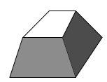
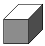
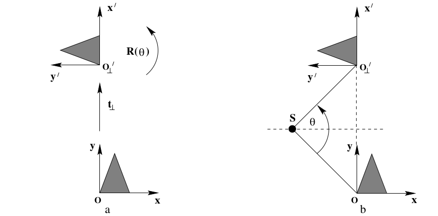

# Phân cấp các loại biến đổi
Phần này đề cập đến các phép biến đổi xạ ảnh tương tự như ở chương trước (similarity, affine và projective), và khái quát hóa chúng. Một phép biến đổi projctive là matrix $4 \times 4$, có tổng cộng 15 dof, gồm 7 dof cho similarity (3 cho phép xoay, 3 cho phép dịch chuyển và 1 cho phép scale), 5 dof cho phép scale affine và 3 dof cho việc biến đổi xạ ảnh. Bảng dưới đây tóm lược lại những phép biến đổi (những tính chất giống với ở chương 2 sẽ không được ghi lại nữa).

| Nhóm                | Matrix                                                              | Sự bóp méo hình                                  | Yếu tố bất biến                                                                         |
|---------------------|---------------------------------------------------------------------|--------------------------------------------------|-----------------------------------------------------------------------------------------|
| Projective (15 dof) | $\begin{bmatrix} A & \mathbf{t} \\ \mathbf{v}^T & v \end{bmatrix}$  | . | Giao điểm và sự tiếp tuyến giữa các mặt phẳng tại giao điểm. Dấu hiệu của độ cong Guass |
| Affine (12 dof)     | $\begin{bmatrix} A & \mathbf{t} \\ \mathbf{0}^T & v \end{bmatrix}$  | . | Các mặt phẳng song song, tỉ lệ thể tích, trọng tâm. Mặt phẳng tại vô cùng $\pi_\infty$  |
| Similarity (7 dof)  | $\begin{bmatrix} sR & \mathbf{t} \\ \mathbf{0}^T & v \end{bmatrix}$ | . | Đường conic tuyệt đối $\Omega _\infty$                                                  |
| Euclidean (6 dof)   | $\begin{bmatrix} sR & \mathbf{t} \\ \mathbf{0}^T & v \end{bmatrix}$ | . | Thể tích                                                                                |

*Bảng thể hiện một số phép biến đổi hay sử dụng, trong đó $A$ là matrix $3 \times 3$ khả nghịch, $R$ là matrix thể hiện phép xoay trong không gian, $\mathbf{t} = (t_X, t_Y, t_Z)$ thể hiện phép dịch chuyển $\mathbf{v}$ là một vector 3 chiều bất kì, $v$ đại lượng vô hướng. Cột sự bóp méo thẻ hiện sự tác động của của phép biến đổi lên một khối lập phương.*

Hai tính chất quan trọng ta cần quan tâm là sự song song và các góc bằng nhau. Ví dụ sau phép biến đổi affine, tính chất song song vẫn được giữ lại, nhưng góc đã bị bóp méo. Sau phép projective thì tính song song sẽ bị mất.

## Sự phân rã xoắn ốc (screw decomposition)
Một phép biến đổi Euclidean trên mặt phẳng trong không gian 3 chiều là sự kết hợp giữa một phép dịch chuyển trên mặt phẳng và một phép quay có trục quay vuông góc với mặt phẳng. Tuy nhiên với phép biến đổi Euclidean trong không gian lại tổng quát hơn và phép xoay sẽ không có trục quay vuông góc với vector dịch chuyển. Sự phân rã xoắn ốc cho phép đưa bất cứ phép biến đổi Euclidean nào thành trường hợp gần đơn giản như trên mặt phẳng 2 chiều. Ta có kết quả sau

> Bất cứ phép dịch chuyển và quay nào đều tương đương với một phép quay trên trục xoắn và phép dịch chuyển ngang với trục đó. Ở đây trục xoán song song với trục quay.

**Chứng minh**:
- Trường hợp với mặt phẳng, kết quả trên quá rõ ràng, xem hình vẽ sau:

Hình a thể hiện một phép dịch chuyển theo vector $t_\perp$s và xoay một góc $\theta$. Trục xoay là đường thẳng vuông góc với mặt phẳng. Hai phép biến đổi này có thể chuyển thành duy nhất 1 phép xoay như ở hình b. Trục quay sẽ giao với mặt phẳng tại điểm $S$ nằm trên trục trực của $OO_\perp$ (hoặc bất cứ đường thẳng nối 2 điểm tương ứng nào) và $\widehat{OSO_\perp} = \theta$.
- Trường hợp với không gian

Với phép dịch chuyển $\mathbf{t}$ bất kì ta có thể biến đổi thành $\mathbf t = \mathbf t _\perp + \mathbf t _\parallel$, trong đó $\mathbf t _\parallel$ sẽ song song với trục quay, và $\mathbf t _\perp$ sẽ vuông góc với trục quay. Ta áp dụng kết quả trên mặt phẳng trước để gộp phép dịch chuyển $\mathbf t _\perp$ và quay thành 1 phép quay như hình a, và còn lại 1 phép dịch chuyển $\mathbf t _\parallel$ và kết quả được chứng minh.